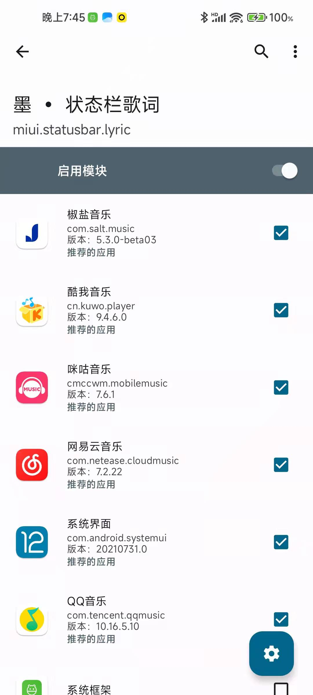
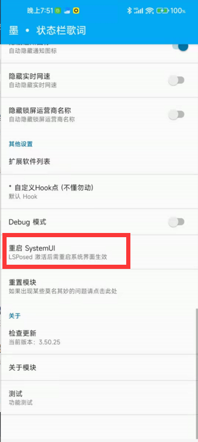
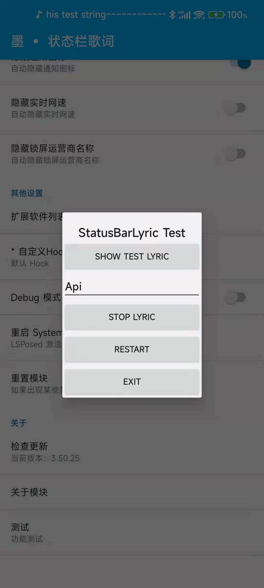
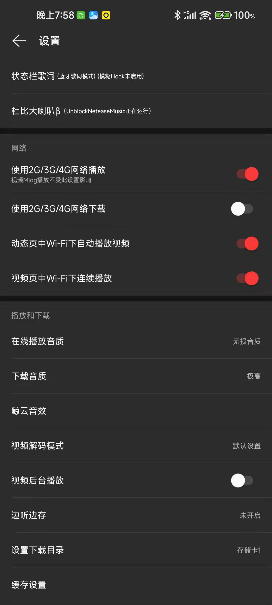
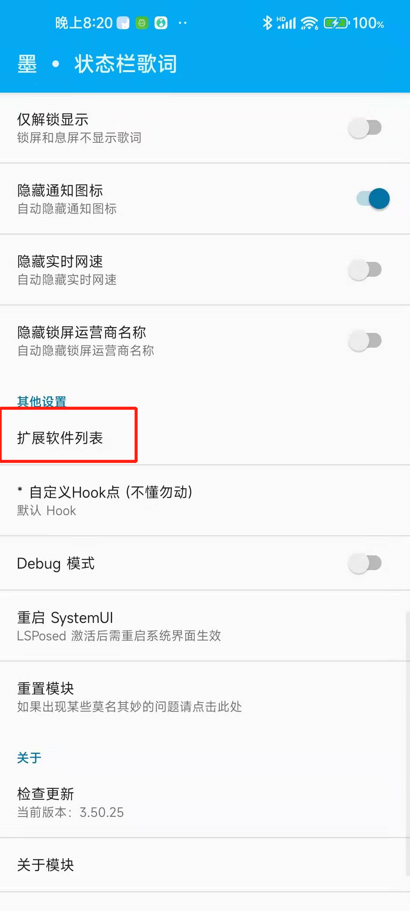
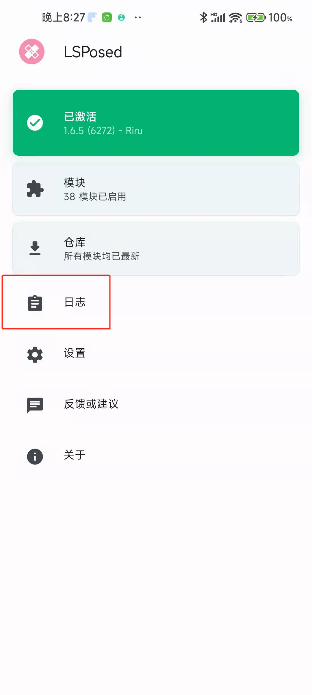
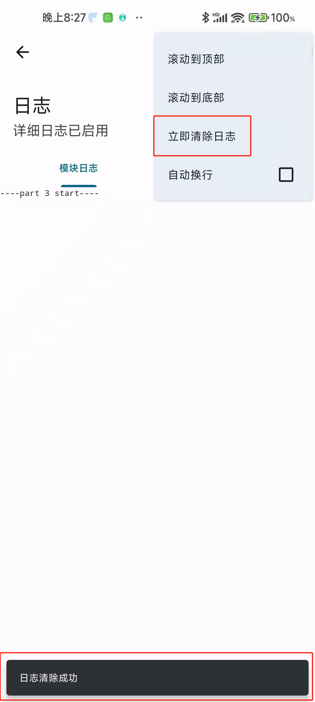
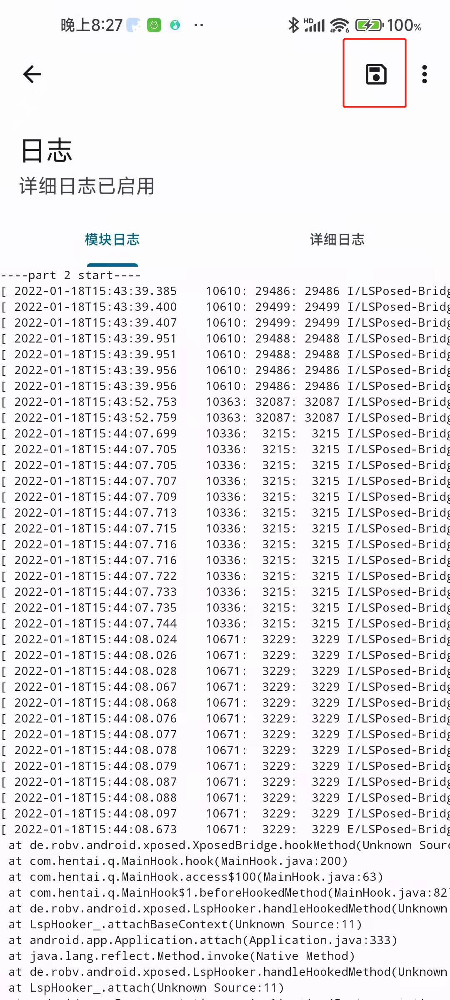
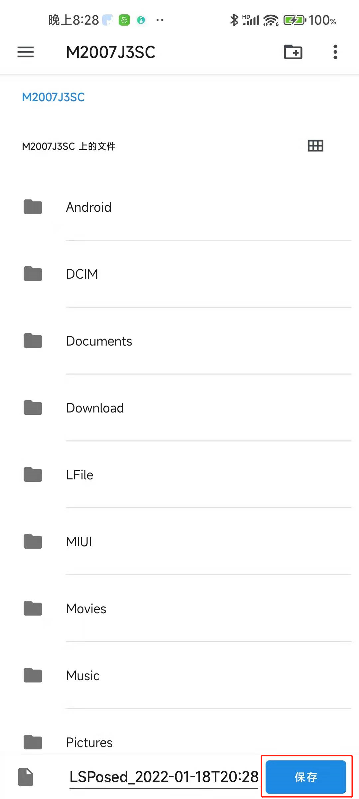

# 使用帮助

## 导航
* [使用前提](#使用前提)
* [LSPosed](#LSPosed)
* [墨•状态栏歌词](#启用模块)
* [问题自查](#问题自查)
* [扩展软件](#扩展软件)
* [日志](#保存日志)

## 使用前提

* 一颗爱折腾的心
* 会看文字
* LSPosed

## LSPosed

打开你桌面上的粉色创可贴

如果没有尝试在拨号键盘输入 __\*#\*#5776733#\*#\*__

点击 模块 -> 墨•状态栏歌词

#### 启用模块

并勾选推荐应用 (并非需要请勿勾选其他软件)

## 墨•状态栏歌词

打开 __总开关__ 并按自己需求进行设置

#### 带 __*__ 号的内容需要重启SystemUI (系统界面)

设置完成后点击下方的 __重启 SystemUI__ 按钮

## 问题自查

点击 __测试__ (部分手机可能无法弹出测试界面)

在弹出的界面点击 第一个按钮 (SHOW TEST LYRIC)

如果正常显示 请检查音乐软件版本是否正确

并检查音乐app内的 __墨•状态栏歌词__ 开关是否打开

仅限 __( QQ音乐 网易云音乐8.0.41以上 咪咕音乐 魅族音乐 )__

测试完毕请一定要点击 __第二个按钮 (STOP LYRIC)__

并点击 __第四个按钮 (EXIT)__ 退出测试界面

## 网易云音乐

第一个代表模式， 第二个是模糊Hook，仅限8.0.41以上启用

只要两个其中一个生效就能正常获取歌词

## 扩展软件

点击模块内的 __扩展软件列表__

开启需要使用的软件

并参考步骤 [LSPosed](#LSPosed) 勾选开启的软件

## 日志

#### 导航
* [LSPosed](#LSPosed)
* [清空日志](#清空日志)
* [保存日志](#保存日志)

如果以上方法都无法显示歌词

请检查模块版本是否为最新，若为最新请下载debug版本。

并打开 __Debug模式__ 开关

如果是 __SystemUI (系统界面)__ 的问题：

* 打开 LSPosed 中的 日志 并清空
* 打开Debug模式开关
* 重启 SystemUI
* 重复刚才的操作
* 打开 LSPosed 中的 日志 并保存

其他软件如上步骤一样

### 保存和清空日志

如何打开 LSPosed 请查看 [LSPosed](#LSPosed) 章节

点击软件主界面的 __日志__

#### 清空日志

#### 保存日志

点击保存日志按钮

选择日志的保存位置

点击保存即可 (要记得你保存在哪了)
